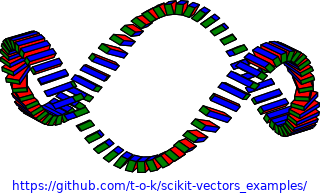
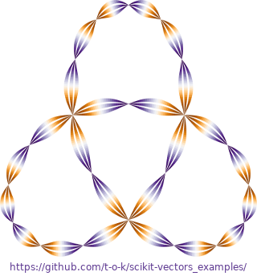

# scikit-vectors examples

This repository contains example files for the scikit-vectors Python library.

Link to this repository: https://github.com/t-o-k/scikit-vectors_examples

Link to the scikit-vectors repository: https://github.com/t-o-k/scikit-vectors

Link to the wiki for the scikit-vectors library: https://github.com/t-o-k/scikit-vectors/wiki

### Trefoil Knot Tube example
[Jupyter notebook](Trefoil_Knot_Tube.ipynb)\

[Interactive Jupyter notebook](https://mybinder.org/v2/gh/t-o-k/scikit-vectors_examples/master?filepath=Trefoil_Knot_Tube.ipynb)

### Bezier Surfaces example
[Jupyter notebook](Bezier_Surfaces.ipynb)\

[Interactive Jupyter notebook](https://mybinder.org/v2/gh/t-o-k/scikit-vectors_examples/master?filepath=Bezier_Surfaces.ipynb)

### Frenet Frames along curve example
[Jupyter notebook](Frenet_Frames_along_curve.ipynb)\

[Interactive Jupyter notebook](https://mybinder.org/v2/gh/t-o-k/scikit-vectors_examples/master?filepath=Frenet_Frames_along_curve.ipynb)

### Offset Curves along a parametric curve example
[Jupyter notebook](Offset_Curves_along_a_parametric_curve.ipynb)\

[Interactive Jupyter notebook](https://mybinder.org/v2/gh/t-o-k/scikit-vectors_examples/master?filepath=Offset_Curves_along_a_parametric_curve.ipynb)
